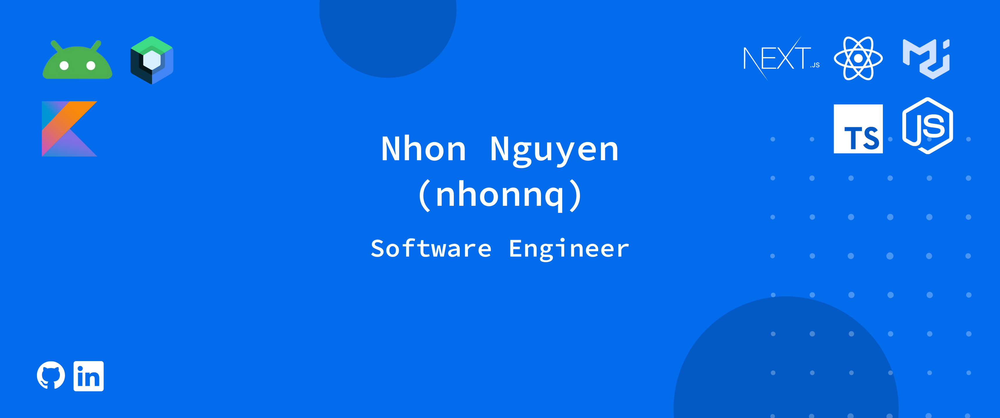

<h1 align="center">Hello There! I'm <a href='https://nhonnq-201014.web.app/'>Nhon Nguyen</a> </h1>

<p align='center'>
<a href="https://www.linkedin.com/in/nhon-nguyen-5b013a157" target="blank"></a>
<a href="https://github.com/nhonnq" target="blank"></a>
<br><br>

---

<br>


## I'm a mobile app developer focused on Android using Jetpack Compose. I also build iOS and web apps.

- 👨‍💻 I’m currently working on Kotlin Multiplatform, Compose Multiplatform and Android Development.
- 📚 I’m currently exploring Kotlin Multiplatform and harnessing the power of it at my org😅
- 💪🏼 Future Goals: Peak out at Kotlin Multiplatform and Android development.
<br>

---

## 🛠️ Tech Stack
- Android (Jetpack Compose, Kotlin)
- iOS (Swift)
- Web (React, TypeScript)
- Tools: Git, Docker, Firebase

---

### Languages 🛠 
[](https://skillicons.dev)

### Development Frameworks and Libraries
[](https://skillicons.dev)

### Databases and Cloud Platforms 🛠 
[](https://skillicons.dev)

### IDEs and Tools
[](https://skillicons.dev)

### Socials
[](https://skillicons.dev)
---

<br/>
<h2 align="center"> Github Statistics 📈</h2>
 
<a href="https://github.com/anuraghazra/github-readme-stats">
  
</a>
<a href="https://github.com/anuraghazra/github-readme-stats">
  
</a>
<a href="https://github.com/anuraghazra/github-readme-stats">
  
</a><br><br>

<!--START_SECTION:waka-->

```txt
From: 30 April 2023 - To: 05 May 2025

Total Time: 2,137 hrs 34 mins

Kotlin                 1,651 hrs 1 min ███████████████████▒░░░░░   77.24 %
TypeScript             335 hrs 37 mins ████░░░░░░░░░░░░░░░░░░░░░   15.70 %
TOML                   32 hrs 22 mins  ▒░░░░░░░░░░░░░░░░░░░░░░░░   01.51 %
XML                    23 hrs 23 mins  ▒░░░░░░░░░░░░░░░░░░░░░░░░   01.09 %
Text                   13 hrs 28 mins  ░░░░░░░░░░░░░░░░░░░░░░░░░   00.63 %
```

<!--END_SECTION:waka-->

<picture>
  <source media="(prefers-color-scheme: dark)" srcset="https://github.com/nhonnq/nhonnq/blob/output/github-contribution-grid-snake-dark.svg" />
  <source media="(prefers-color-scheme: light)" srcset="https://github.com/nhonnq/nhonnq/blob/output/github-contribution-grid-snake.svg" />
  
</picture>

<!--
**nhonnq/nhonnq** is a ✨ _special_ ✨ repository because its `README.md` (this file) appears on your GitHub profile.

Here are some ideas to get you started:

- 🔭 I’m currently working on ...
- 🌱 I’m currently learning ...
- 👯 I’m looking to collaborate on ...
- 🤔 I’m looking for help with ...
- 💬 Ask me about ...
- 📫 How to reach me: ...
- 😄 Pronouns: ...
- ⚡ Fun fact: ...
-->
